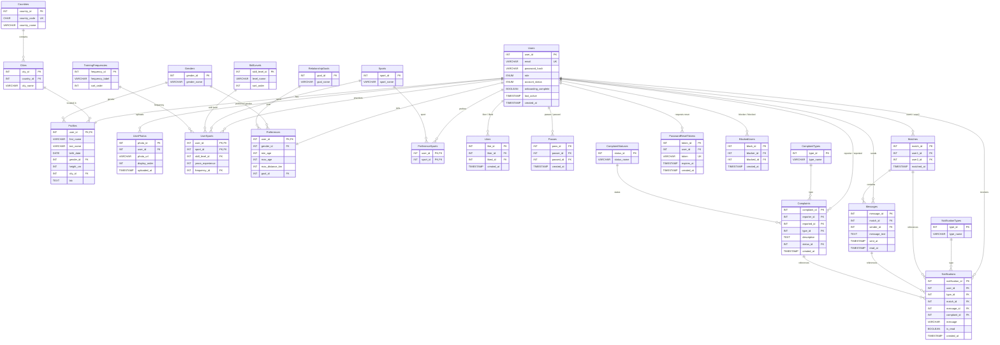

# SportSync – Entity Relationship Diagram

Paste the mermaid code block below into [Mermaid Live Editor](https://mermaid.live) to render and export as PNG/SVG for your document.

```mermaid
erDiagram
    direction TB

    Users {
        INT user_id PK
        VARCHAR email UK
        VARCHAR password_hash
        ENUM role
        ENUM account_status
        BOOLEAN onboarding_complete
        TIMESTAMP last_active
        TIMESTAMP created_at
    }

    Genders {
        INT gender_id PK
        VARCHAR gender_name
    }

    Countries {
        INT country_id PK
        CHAR country_code UK
        VARCHAR country_name
    }

    Cities {
        INT city_id PK
        INT country_id FK
        VARCHAR city_name
    }

    Profiles {
        INT user_id PK, FK
        VARCHAR first_name
        VARCHAR last_name
        DATE birth_date
        INT gender_id FK
        INT height_cm
        INT city_id FK
        TEXT bio
    }

    UserPhotos {
        INT photo_id PK
        INT user_id FK
        VARCHAR photo_url
        INT display_order
        TIMESTAMP uploaded_at
    }

    Sports {
        INT sport_id PK
        VARCHAR sport_name
    }

    SkillLevels {
        INT skill_level_id PK
        VARCHAR level_name
        INT sort_order
    }

    TrainingFrequencies {
        INT frequency_id PK
        VARCHAR frequency_label
        INT sort_order
    }

    UserSports {
        INT user_id PK, FK
        INT sport_id PK, FK
        INT skill_level_id FK
        INT years_experience
        INT frequency_id FK
    }

    RelationshipGoals {
        INT goal_id PK
        VARCHAR goal_name
    }

    Preferences {
        INT user_id PK, FK
        INT gender_id FK
        INT min_age
        INT max_age
        INT max_distance_km
        INT goal_id FK
    }

    PreferenceSports {
        INT user_id PK, FK
        INT sport_id PK, FK
    }

    Likes {
        INT like_id PK
        INT liker_id FK
        INT liked_id FK
        TIMESTAMP created_at
    }

    Passes {
        INT pass_id PK
        INT passer_id FK
        INT passed_id FK
        TIMESTAMP created_at
    }

    Matches {
        INT match_id PK
        INT user1_id FK
        INT user2_id FK
        TIMESTAMP matched_at
    }

    Messages {
        INT message_id PK
        INT match_id FK
        INT sender_id FK
        TEXT message_text
        TIMESTAMP sent_at
        TIMESTAMP read_at
    }

    NotificationTypes {
        INT type_id PK
        VARCHAR type_name
    }

    Notifications {
        INT notification_id PK
        INT user_id FK
        INT type_id FK
        INT match_id FK
        INT message_id FK
        INT complaint_id FK
        VARCHAR message
        BOOLEAN is_read
        TIMESTAMP created_at
    }

    PasswordResetTokens {
        INT token_id PK
        INT user_id FK
        VARCHAR token UK
        TIMESTAMP expires_at
        TIMESTAMP created_at
    }

    BlockedUsers {
        INT block_id PK
        INT blocker_id FK
        INT blocked_id FK
        TIMESTAMP created_at
    }

    ComplaintTypes {
        INT type_id PK
        VARCHAR type_name
    }

    ComplaintStatuses {
        INT status_id PK
        VARCHAR status_name
    }

    Complaints {
        INT complaint_id PK
        INT reporter_id FK
        INT reported_id FK
        INT type_id FK
        TEXT description
        INT status_id FK
        TIMESTAMP created_at
    }

    %% Core user relationships
    Users ||--|| Profiles : "has"
    Users ||--o{ UserPhotos : "uploads"
    Users ||--|| Preferences : "sets"
    Users ||--o{ PasswordResetTokens : "requests reset"
    Users ||--o{ Notifications : "receives"
    Users ||--o{ UserSports : "practices"
    Users ||--o{ PreferenceSports : "prefers"
    Users ||--o{ Likes : "liker / liked"
    Users ||--o{ Passes : "passer / passed"
    Users ||--o{ Matches : "user1 / user2"
    Users ||--o{ Messages : "sends"
    Users ||--o{ BlockedUsers : "blocker / blocked"
    Users ||--o{ Complaints : "reporter / reported"

    %% Location lookup relationships
    Countries ||--o{ Cities : "contains"
    Cities ||--o{ Profiles : "located in"

    %% Gender lookup relationships
    Genders ||--o{ Profiles : "gender"
    Genders ||--o{ Preferences : "preferred gender"

    %% Sport relationships
    Sports ||--o{ UserSports : "sport"
    Sports ||--o{ PreferenceSports : "sport"

    %% Sport attribute lookup relationships
    SkillLevels ||--o{ UserSports : "skill level"
    TrainingFrequencies ||--o{ UserSports : "frequency"

    %% Preference lookup relationships
    RelationshipGoals ||--o{ Preferences : "goal"

    %% Match and messaging
    Matches ||--o{ Messages : "contains"

    %% Complaint lookup relationships
    ComplaintTypes ||--o{ Complaints : "type"
    ComplaintStatuses ||--o{ Complaints : "status"

    %% Notification lookup and typed references
    NotificationTypes ||--o{ Notifications : "type"
    Matches ||--o{ Notifications : "references"
    Messages ||--o{ Notifications : "references"
    Complaints ||--o{ Notifications : "references"
```
