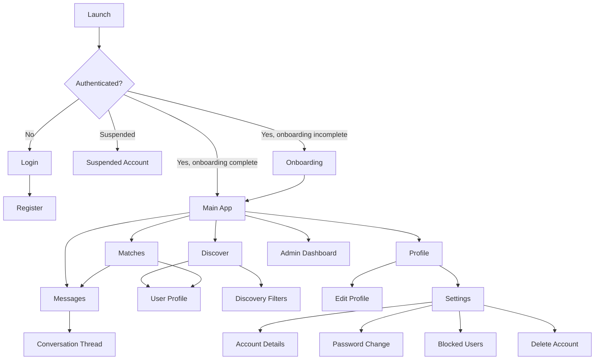

# SportSync Navigation Map

This map documents the proposed mobile-first information architecture for the high-fidelity prototype.

## Primary Flow

## Top-Level Structure

For the prototype, the cleanest mobile structure is:

- `Discover`
- `Matches`
- `Messages`
- `Profile`

Settings should be accessed from `Profile` rather than treated as a permanent top-level destination. This is slightly cleaner than the current coded tab layout and aligns better with common Android mobile patterns.

## Rationale

- `Discover` is the core task and should be immediately available after login.
- `Matches` is the natural bridge between browsing and conversation.
- `Messages` deserves persistent visibility because it represents active engagement.
- `Profile` anchors identity, photos, sports, and account controls.
- `Settings` is important, but it is a secondary maintenance function rather than a primary daily task.

## Design Rationale Against Mobile UX Guidance

The navigation structure was shaped around mobile conventions:

- Material Design states that bottom navigation is primarily for mobile and works best for three to five top-level destinations.
- The coded project already follows this general idea with a tab-bar structure.
- For the final Figma prototype, consolidating settings under profile reduces clutter and improves task focus.

## Suggested Figma Prototype Path

Use this as the demo path in Figma:

1. `Login`
2. `Onboarding`
3. `Discover`
4. `View User Profile`
5. `Like / Match Modal`
6. `Matches`
7. `Messages`
8. `Profile`
9. `Settings`

That sequence is short enough for a lecturer to understand quickly, but broad enough to demonstrate navigation, content hierarchy, and interaction variety.
